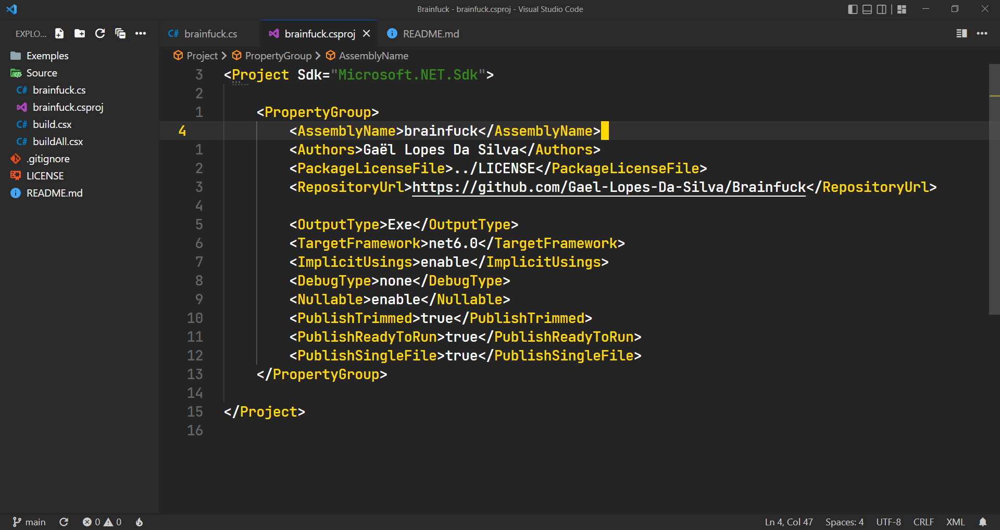
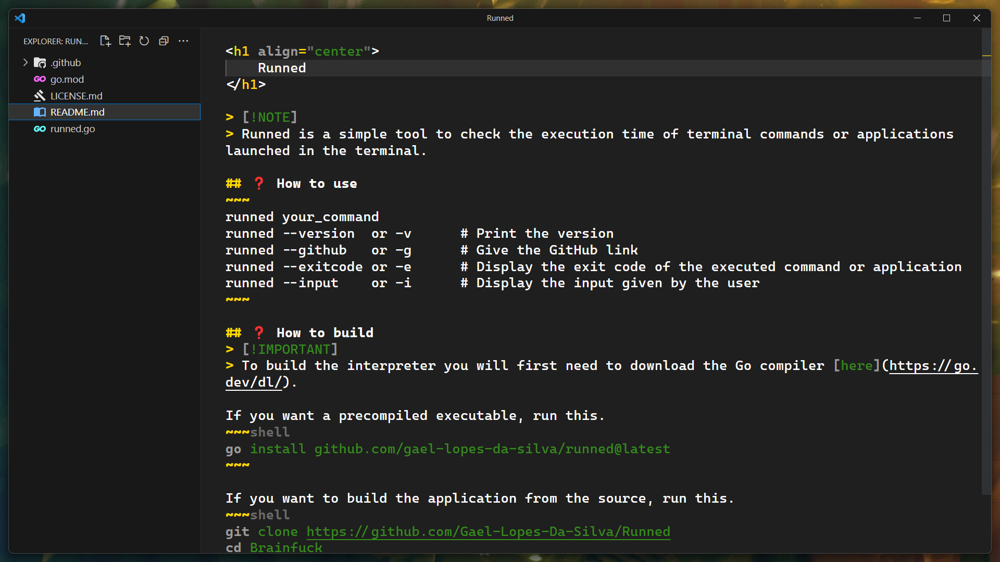
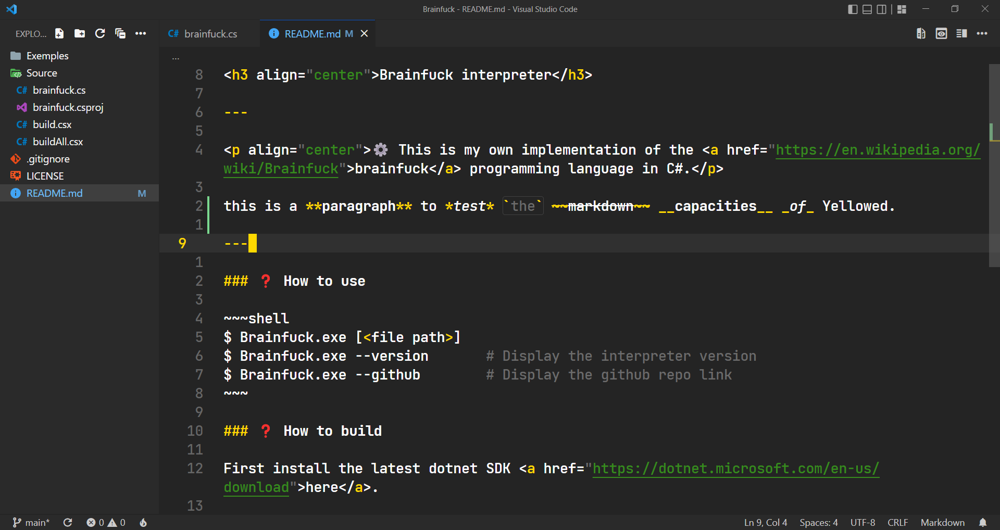

<h3 align="center">
    Visual Studio Code configuration
</h3>

---

    ⚙️ This is my configuration for Visual Studio Code. The key bindings can be difficult to understand. You can see with the keybindings.json and the keybinding extention.

    ❗ I only added the extensions that change vs code, not the ones related to the languages.

---

### 🖼️ Screenshots

### 🗒️ Font
- [Cascadia Mono](https://github.com/microsoft/cascadia-code)

### 🏞️ Theme
- [Yellowed Marketplace](https://marketplace.visualstudio.com/items?itemName=gael-lopes-da-silva.yellowed)
- [Yellowed Github](https://github.com/Gael-Lopes-Da-Silva/Yellowed)

### ⚙️ Extensions
- [Batch Rename](https://marketplace.visualstudio.com/items?itemName=JannisX11.batch-rename-extension)
- [Better Align](https://marketplace.visualstudio.com/items?itemName=Chouzz.vscode-better-align)
- [Choose a License](https://marketplace.visualstudio.com/items?itemName=ultram4rine.vscode-choosealicense)
- [Code Runner](https://marketplace.visualstudio.com/items?itemName=formulahendry.code-runner)
- [Command Runner](https://marketplace.visualstudio.com/items?itemName=edonet.vscode-command-runner)
- [Emoji Toolbok](https://marketplace.visualstudio.com/items?itemName=ecrax.emoji-toolbox)
- [Error Lens](https://marketplace.visualstudio.com/items?itemName=usernamehw.errorlens)
- [Feather Product Icons](https://marketplace.visualstudio.com/items?itemName=melishev.feather-vscode)
- [File System Toolbox](https://marketplace.visualstudio.com/items?itemName=CarloCardella.vscode-filesystemtoolbox)
- [File Utils](https://marketplace.visualstudio.com/items?itemName=sleistner.vscode-fileutils)
- [Git History](https://marketplace.visualstudio.com/items?itemName=GuodongSun.vscode-git-cruise)
- [Hex Editor](https://marketplace.visualstudio.com/items?itemName=ms-vscode.hexeditor)
- [IntelliCode](https://marketplace.visualstudio.com/items?itemName=VisualStudioExptTeam.vscodeintellicode)
- [IntelliCode Completions](https://marketplace.visualstudio.com/items?itemName=VisualStudioExptTeam.vscodeintellicode-completions)
- [JAR Viewer](https://marketplace.visualstudio.com/items?itemName=wmanth.jar-viewer)
- [Live Preview](https://marketplace.visualstudio.com/items?itemName=ms-vscode.live-server)
- [Live Server](https://marketplace.visualstudio.com/items?itemName=ritwickdey.LiveServer)
- [Markdown All in One](https://marketplace.visualstudio.com/items?itemName=yzhang.markdown-all-in-one)
- [Markdown Emoji](https://marketplace.visualstudio.com/items?itemName=bierner.markdown-emoji)
- [NERDTree](https://marketplace.visualstudio.com/items?itemName=Llam4u.nerdtree)
- [Output Colorizer](https://marketplace.visualstudio.com/items?itemName=IBM.output-colorizer)
- [Output Link to File](https://marketplace.visualstudio.com/items?itemName=93akkord.output-link-to-file)
- [Path Intellisense](https://marketplace.visualstudio.com/items?itemName=christian-kohler.path-intellisense)
- [Peek Hidden Files](https://marketplace.visualstudio.com/items?itemName=adrianwilczynski.toggle-hidden)
- [Polacode](https://marketplace.visualstudio.com/items?itemName=pnp.polacode)
- [Ressource Monitor](https://marketplace.visualstudio.com/items?itemName=mutantdino.resourcemonitor)
- [Studio Icons](https://marketplace.visualstudio.com/items?itemName=jtlowe.vscode-icon-theme)
- [Text Toolbox](https://marketplace.visualstudio.com/items?itemName=CarloCardella.vscode-texttoolbox)
- [TODO Highlight](https://marketplace.visualstudio.com/items?itemName=wayou.vscode-todo-highlight)
- [Vimspired](https://marketplace.visualstudio.com/items?itemName=bmalehorn.vimspired)
- [WSL](https://marketplace.visualstudio.com/items?itemName=ms-vscode-remote.remote-wsl)

### 🔧 Settings
~~~json with comments
{
    // keybindings
    "vimspired.keybindings": {
        "i": "vimspired.toggle",

        "k": "cursorUp",
        "j": "cursorDown",
        "h": "cursorLeft",
        "l": "cursorRight",
        "K": "cursorUpSelect",
        "J": "cursorDownSelect",
        "H": "cursorLeftSelect",
        "L": "cursorRightSelect",
        
        ">": "cursorTop",
        "<": "cursorBottom",
        ".": "cursorEnd",
        ",": "cursorHome",
        
        "/": "actions.find",
        ";": "editor.action.triggerSuggest",
        "c": ["editor.action.clipboardCopyAction", "vimspired.cancelSelection"],
        "p": "editor.action.clipboardPasteAction",
        "u": "undo",
        "r": "redo",
        "[": "editor.fold",
        "]": "editor.unfold",

        "o": ["editor.action.insertLineAfter", "vimspired.enterInsert"],
        "O": ["editor.action.insertLineBefore", "vimspired.enterInsert"],

        "e": { // editor
            "l": "workbench.action.moveEditorRightInGroup",   // right
            "h": "workbench.action.moveEditorLeftInGroup",    // left
            "p": "workbench.action.pinEditor",                // pin
            "u": "workbench.action.unpinEditor",              // unpin
            "m": "workbench.action.showAllEditors",           // menu
            "R": "workbench.action.reopenClosedEditor",       // reopen
            "1": "workbench.action.previousEditor",           // previous
            "2": "workbench.action.nextEditor",               // next
        },

        "v": { // viewport
            ".": {"command": "editorScroll", "args": {"to": "up", "by": "halfPage"}},
            ",": {"command": "editorScroll", "args": {"to": "down", "by": "halfPage"}},
            "<": {"command": "editorScroll", "args": {"to": "down", "by": "page"}},
            ">": {"command": "editorScroll", "args": {"to": "up", "by": "page"}},
            "s": "editor.action.toggleStickyScroll", // sticky scroll
        },

        "m": { // move
            "j": {"command": "cursorMove", "args": {"to": "prevBlankLine"}},
            "k": {"command": "cursorMove", "args": {"to": "nextBlankLine"}},
            "c": {"command": "cursorMove", "args": {"to": "viewPortCenter"}},
            ">": {"command": "cursorMove", "args": {"to": "viewPortTop"}}, 
            "<": {"command": "cursorMove", "args": {"to": "viewPortBottom"}},
            "l": "workbench.action.gotoLine",     // line
            "b": "editor.action.jumpToBracket",   // bracket
        },

        "w": { // word
            "r": "editor.action.rename",                   // rename
            "R": "editor.action.startFindReplaceAction",   // replace
            "s": "actions.find",                           // search
            "c": "editor.action.clipboardCutAction",       // cut
            "S": "editor.action.sortLinesAscending",       // sort
            "l": "editor.action.openLink",                 // link
            "d": "editor.action.goToDeclaration",          // declaration
            "h": "editor.action.showHover",                // hover
            "p": "editor.action.triggerParameterHints",    // parameters
            "a": "vscode-better-align.align",              // align
        },

        "s": { // select
            "a": "editor.action.selectAll",          // all
            "b": "editor.action.selectToBracket",    // brackets
            "o": "editor.action.selectHighlights",   // occurence
            "c": "vimspired.cancelSelection",        // cancel
        },

        "a": { // anchor
            "a": "editor.action.setSelectionAnchor",         // add
            "s": "editor.action.selectFromAnchorToCursor",   // select
            "j": "editor.action.goToSelectionAnchor",        // jump
            "c": "editor.action.cancelSelectionAnchor",      // cancel
        },

        "b": { // block
            "a": "color-blocks.add",      // add
            "t": "color-blocks.toggle",   // toggle
        },

        "d": { // delete
            "s": "deleteLeft",                           // selection
            "l": "editor.action.deleteLines",            // line
            "w": "deleteInsideWord",                     // word
            "d": "editor.action.removeDuplicateLines",   // duplicates
            "L": "deleteAllLeft",                        // left
            "R": "deleteAllRight",                       // right
        },

        "t": { // text
            "f": "vscode-texttoolbox.FilterLinesUsingRegExpOrString",   // filter
            "S": "vscode-texttoolbox.SplitSelection",                   // split
            "t": "vscode-texttoolbox.TabOut",                           // tab out
            "T": "vscode-texttoolbox.ToggleTabOut",                     // tab out toggle
            "O": "vscode-texttoolbox.transformToOrderedList",           // ordered list
            
            "a": { // align
                "t": "vscode-texttoolbox.AlignAsTable",              // table
                "h": "vscode-texttoolbox.AlignAsTableWithHeaders",   // header
                "s": "vscode-texttoolbox.AlignToSeparator",          // separator
            },
            "c": { // conversion
                "p": "vscode-texttoolbox.PascalCase",                    // pascal case
                "c": "vscode-texttoolbox.CamelCase",                     // camel case
                "C": "vscode-texttoolbox.ConstantCase",                  // constant case
                "h": "vscode-texttoolbox.HeaderCase",                    // header case
                "d": "vscode-texttoolbox.DotCase",                       // dot case
                "k": "vscode-texttoolbox.KebabCase",                     // kebab case
                "S": "vscode-texttoolbox.SentenceCase",                  // sentence case
                "s": "vscode-texttoolbox.SnakeCase",                     // snake case
                "i": "vscode-texttoolbox.InvertCase",                    // invert case
                "H": "vscode-texttoolbox.ConvertDecimalToHexadecimal",   // hexadecimal
                "D": "vscode-texttoolbox.ConvertHexadecimalToDecimal",   // decimal
            },
            "j": { // json
                "f": "vscode-texttoolbox.FixJson",                 // format
                "w": "vscode-texttoolbox.EscapeWin32PathInJson",   // win32
                "m": "vscode-texttoolbox.MinifyJson",              // minify
                "s": "vscode-texttoolbox.StringifyJson",           // stringify
            },
            "p": { // pad
                "l": "vscode-texttoolbox.PadSelectionLeft",    // left
                "r": "vscode-texttoolbox.PadSelectionRight",   // right
            },
            "P": { // path
                "p": "vscode-texttoolbox.TransformPathToPosix",   // posix
                "w": "vscode-texttoolbox.TransformPathToWin32",   // win32
            },
            "i": { // insert
                "g": "vscode-texttoolbox.InsertGUID",              // guid
                "G": "vscode-texttoolbox.InsertGuidAllZeros",      // guid zeros
                "d": "vscode-texttoolbox.InsertDate",              // date
                "r": "vscode-texttoolbox.PickRandom",              // random
                "l": "vscode-texttoolbox.InsertLoremIpsum",        // lorem
                "L": "vscode-texttoolbox.InsertLineNumbers",       // line number
                "n": "vscode-texttoolbox.InsertSequenceNumbers",   // numbers sequece
                "c": "vscode-texttoolbox.InsertCurrency",          // currency
            },
            "r": { // remove
                "b": "vscode-texttoolbox.RemoveBrackets",                          // brackets
                "q": "vscode-texttoolbox.RemoveQuotes",                            // quotes
                "e": "vscode-texttoolbox.RemoveAllEmptyLines",                     // empty lines
                "c": "vscode-texttoolbox.RemoveControlCharacters",                 // control characters
                "d": "vscode-texttoolbox.RemoveDuplicateLines",                    // duplicates
                "r": "vscode-texttoolbox.RemoveRedundantEmptyLines",               // redundant empty lines
            },
            "h": { // highlight
                "h": "vscode-texttoolbox.HighlightText",            // highlight
                "c": "vscode-texttoolbox.HighlightTextWithColor",   // color

                "a": { // all
                    "i": "vscode-texttoolbox.HighlightAllMatchesCaseInsensitive",            // insensitive
                    "I": "vscode-texttoolbox.HighlightAllMatchesCaseInsensitiveWithColor",   // insensitive color
                    "s": "vscode-texttoolbox.HighlightAllMatchesCaseSensitive",              // sensitive
                    "S": "vscode-texttoolbox.HighlightAllMatchesCaseSensitiveWithColor",     // sensitive color
                },
                "r": { // remove
                    "r": "vscode-texttoolbox.RemoveHighlight",       // remove
                    "a": "vscode-texttoolbox.RemoveAllHighlights",   // all
                },
                "R": { // regex
                    "r": "vscode-texttoolbox.HighlightWithRegExp",            // regex
                    "R": "vscode-texttoolbox.HighlightWithRegExpWithColor",   // regex color
                },
            },
            "s": { // sort
                "l": "vscode-texttoolbox.SortLines",                            // lines
                "e": "vscode-texttoolbox.SortLinesByLength",                    // length
            },
            "C": { // cycle
                "b": "vscode-texttoolbox.CycleBrackets",   // brackets
                "q": "vscode-texttoolbox.CycleQuotes",     // quotes
            },
            "o": { // open
                "n": "vscode-texttoolbox.OpenSelectionInNewEditor", // new editor
                "u": "vscode-texttoolbox.OpenSelectionInNewEditor", // under cursor
            },
            "e": { // encode
                "b": "vscode-texttoolbox.convertToBase64",   // base64
                "h": "vscode-texttoolbox.toHTML",            // html
                "u": "vscode-texttoolbox.encodeUri",         // uri
            },
            "d": { // decode
                "b": "vscode-texttoolbox.convertFromBase64",   // base64
                "h": "vscode-texttoolbox.fromHTML",            // html
                "u": "vscode-texttoolbox.decodeUri",           // uri
                "j": "vscode-texttoolbox.decodeJWTToken",      // jwt
            },
        },

        " ": { // leader
            "F": { // folder
                "o": "workbench.action.files.openFolder",   // open
                "O": "revealFileInOS",                      // open exeplorer
                "c": "workbench.action.closeFolder",        // close
                "s": "extension.showFiles",                 // show
                "h": "extension.hideFiles",                 // hide
                "t": "extension.toggleFiles",               // toggle
            },
            "f": { // file
                "o": "workbench.action.files.openFile",              // open
                "c": "workbench.action.closeActiveEditor",           // close
                "s": "workbench.action.files.save",                  // save
                "S": "workbench.action.files.saveFiles",             // save all
                "g": "workbench.action.gotoLine",                    // go to
                "l": "workbench.action.editor.changeLanguageMode",   // language
                "f": "editor.action.formatDocument",                 // format
                "r": "editor.action.rename",                         // rename
                "p": "copyFilePath",                                 // path
                "P": "copyRelativeFilePath",                         // relative path
            },
            "s": { // sidebar
                "e": "workbench.view.explorer",                    // explorer
                "g": "workbench.view.scm",                         // git
                "d": "workbench.view.debug",                       // debuger
                "x": "workbench.view.extensions",                  // extensions
                "s": "workbench.action.findInFiles",               // search
                "r": "workbench.action.replaceInFiles",            // replace
                " ": "workbench.action.toggleSidebarVisibility",   // toggle
            },
            "c": { // commands
                "p": "workbench.action.showCommands",   // palette
                "d": "workbench.action.debug.start",    // debug
                "c": "command-runner.run",              // commands
                "r": "code-runner.run",                 // run
                "s": "code-runner.stop",                // stop
            },
            "C": { // console
                "n": "workbench.action.terminal.new",       // new
                "k": "workbench.action.terminal.kill",      // kill
                "K": "workbench.action.terminal.killAll",   // kill all
                "c": "cleanconsole.cleanConsole",           // clean log
            },
            "g": { // git
                "c": "git.commit",           // commit
                "p": "git.push",             // push
                "P": "git.pull",             // pull
                "C": "git.clone",            // clone
                "i": "git.init",             // init
                "a": "commitMsg.autofill",   // auto
            },
            "o": { // options
                "s": "workbench.action.openSettingsJson",            // settings
                "k": "workbench.action.openGlobalKeybindingsFile",   // keysettings
                "r": "workbench.action.reloadWindow",                // reload
                "S": "workbench.action.openGlobalKeybindings",       // shortcuts
                "w": "editor.action.toggleRenderWhitespace",         // whitespace
            },
            "w": { // web
                "r": "extension.liveServer.goOnline",    // run
                "s": "extension.liveServer.goOffline",   // stop
            }
        }
    },

    // extensions
    "C_Cpp.autoAddFileAssociations": true,
    "C_Cpp.autocomplete": "default",
    "C_Cpp.autocompleteAddParentheses": true,
    "C_Cpp.clang_format_sortIncludes": true,
    "C_Cpp.debugShortcut": false,
    "C_Cpp.default.compilerPath": "C:\\Users\\Oasis\\Applications\\Clang\\bin\\cc.exe",
    "C_Cpp.enhancedColorization": "disabled",
    "license.author": "Your name",
    "license.default": "MIT",
    "license.extension": ".md",
    "license.year": "auto",
    "liveServer.settings.donotShowInfoMsg": true,
    "liveServer.settings.donotVerifyTags": true,
    "liveServer.settings.host": "127.0.0.1",
    "liveServer.settings.port": 5500,
    "liveServer.settings.showOnStatusbar": false,
    "nim.enableNimsuggest": true,
    "nim.nimprettyIndent": 2,
    "nim.nimprettyMaxLineLen": 80,
    "nim.nimsuggestRestartTimeout": 60,
    "php.completion.autoimport": "auto-import",
    "php.completion.autoimport-docblock": "auto-import",
    "php.completion.parameters": "parameters",
    "php.highlight-todo.enable": true,
    "polacode.target": "container",
    "polacode.transparentBackground": true,
    "vimspired.insertCursorStyle": "block",
    "vimspired.normalCursorStyle": "underline",
    "code-runner.clearPreviousOutput": true,
    "code-runner.enableAppInsights": false,
    "code-runner.fileDirectoryAsCwd": true,
    "code-runner.ignoreSelection": true,
    "code-runner.saveAllFilesBeforeRun": true,
    "code-runner.saveFileBeforeRun": true,
    "code-runner.showRunCommandInEditorContextMenu": false,
    "code-runner.showRunCommandInExplorerContextMenu": false,
    "code-runner.showRunIconInEditorTitleMenu": false,
    "code-runner.showStopIconInEditorTitleMenu": false,
    "code-runner.executorMapByGlob": {
        "*.c"     : "cc $fullFileName -o $fileNameWithoutExt && $fileNameWithoutExt",
        "*.cpp"   : "cc $fullFileName -o $fileNameWithoutExt && $fileNameWithoutExt",
        "*.cs"    : "dotnet run $dir",
        "*.java"  : "javac $fullFileName && java $fileNameWithoutExt",
        "*.py"    : "python $fullFileName",
        "*.nim"   : "nim compile --run --hints:off --spellSuggest:0 $fullFileName",
        "*.nims"  : "nim --run --hints:off --spellSuggest:0 $fullFileName",
        "*.sh"    : "sh $fullFileName",
        "makefile": "make $fullFileName"
    },
    "command-runner.terminal.autoClear": false, 
    "command-runner.terminal.autoFocus": true,
    "command-runner.terminal.cwd": "${fileDirname}",
    "command-runner.terminal.name": "script",
    "errorLens.delay": 0,
    "errorLens.enableOnDiffView": true,
    "errorLens.enabled": true,
    "errorLens.followCursor": "allLines",
    "errorLens.gutterIconsEnabled": true,
    "errorLens.messageBackgroundMode": "none",
    "errorLens.messageTemplate": "$count $severity: $message",
    "errorLens.onSave": false,
    "errorLens.removeLinebreaks": false,
    "errorLens.scrollbarHackEnabled": false,
    "hexeditor.columnWidth": 16,
    "hexeditor.defaultEndianness": "little",
    "hexeditor.inspectorType": "aside",
    "hexeditor.showDecodedText": true,
    "markdown.extension.list.indentationSize": "inherit",
    "markdown.extension.theming.decoration.renderCodeSpan": true,
    "todohighlight.isEnable": true,
    "todohighlight.isCaseSensitive": true,
    "todohighlight.include": ["**/*.*"],
    "todohighlight.exclude": [
        "**/node_modules/**",
        "**/bower_components/**",
        "**/dist/**",
        "**/build/**",
        "**/.vscode/**",
        "**/.vscode-test/**",
        "**/.github/**",
        "**/_output/**",
        "**/*.min.*",
        "**/*.map",
        "**/.next/**"
    ],
    "todohighlight.keywords": [
        {
            "text"           : "TODO",
            "color"          : "#f1c40f",
            "fontWeight"     : "bold",
            "backgroundColor": "#00000000",
            "regex": {
                "pattern": "(?<=^|\"|:|\\s)TODO(?!\\w)"
            }
        },
        {
            "text"           : "FIXME",
            "color"          : "#e74c3c",
            "fontWeight"     : "bold",
            "backgroundColor": "#00000000",
            "regex": {
                "pattern": "(?<=^|\"|:|\\s)FIXME(?!\\w)"
            }
        },
        {
            "text"           : "NOTE",
            "color"          : "#3498db",
            "fontWeight"     : "bold",
            "backgroundColor": "#00000000",
            "regex": {
                "pattern": "(?<=^|\"|:|\\s)NOTE(?!\\w)"
            }
        },
        {
            "text"           : "HACK",
            "color"          : "#9b59b6",
            "fontWeight"     : "bold",
            "backgroundColor": "#00000000",
            "regex": {
                "pattern": "(?<=^|\"|:|\\s)HACK(?!\\w)"
            }
        },
        {
            "text"           : "BUG",
            "color"          : "#2ecc71",
            "fontWeight"     : "bold",
            "backgroundColor": "#00000000",
            "regex": {
                "pattern": "(?<=^|\"|:|\\s)BUG(?!\\w)"
            }
        }
    ],

    "[nim]": {
        "editor.tabSize": 2,
    },
    "[nimble]": {
        "editor.tabSize": 2,
    },

    // theme
    "editor.tokenColorCustomizations": {
        "textMateRules": [
            {
                "scope": "token.info-token",
                "settings": {
                    "foreground": "#ffd900"
                }
            },
            {
                "scope": "token.warn-token",
                "settings": {
                    "foreground": "#ffd900"
                }
            },
            {
                "scope": "token.error-token",
                "settings": {
                    "foreground": "#ff80f4"
                }
            },
            {
                "scope": "token.debug-token",
                "settings": {
                    "foreground": "#ff80f4"
                }
            }
        ]
    },
    
    // options
    "breadcrumbs.enabled": true,
    "breadcrumbs.filePath": "off",
    "breadcrumbs.icons": true,
    "debug.openDebug": "neverOpen",
    "debug.terminal.clearBeforeReusing": true,
    "diffEditor.codeLens": true,
    "diffEditor.wordWrap": "inherit",
    "editor.autoClosingBrackets": "always",
    "editor.autoClosingQuotes": "always",
    "editor.autoIndent": "full",
    "editor.bracketPairColorization.enabled": false,
    "editor.codeLens": true,
    "editor.colorDecorators": true,
    "editor.cursorBlinking": "solid",
    "editor.cursorStyle": "block",
    "editor.cursorWidth": 3,
    "editor.detectIndentation": false,
    "editor.dragAndDrop": false,
    "editor.emptySelectionClipboard": true,
    "editor.fastScrollSensitivity": 5,
    "editor.find.seedSearchStringFromSelection": "selection",
    "editor.folding": true,
    "editor.foldingHighlight": false,
    "editor.foldingStrategy": "auto",
    "editor.fontFamily": "Cascadia Mono, Jetbrains Mono",
    "editor.fontLigatures": false,
    "editor.fontSize": 18,
    "editor.fontWeight": "600",
    "editor.guides.bracketPairs": false,
    "editor.guides.indentation": true,
    "editor.hideCursorInOverviewRuler": false,
    "editor.inlineSuggest.enabled": true,
    "editor.inlineSuggest.showToolbar": "always",
    "editor.insertSpaces": true,
    "editor.largeFileOptimizations": true,
    "editor.letterSpacing": -0.3,
    "editor.lightbulb.enabled": false,
    "editor.lineHeight": 24,
    "editor.lineNumbers": "relative",
    "editor.linkedEditing": false,
    "editor.links": true,
    "editor.matchBrackets": "always",
    "editor.minimap.enabled": false,
    "editor.overviewRulerBorder": false,
    "editor.padding.bottom": 1,
    "editor.padding.top": 1,
    "editor.quickSuggestionsDelay": 0,
    "editor.renderLineHighlight": "all",
    "editor.renderWhitespace": "none",
    "editor.suggest.filterGraceful": true,
    "editor.suggest.insertMode": "replace",
    "editor.suggest.matchOnWordStartOnly": true,
    "editor.suggest.preview": false,
    "editor.suggest.selectionMode": "always",
    "editor.tabSize": 4,
    "editor.wordWrap": "bounded",
    "editor.wordWrapColumn": 150,
    "editor.wrappingIndent": "same",
    "editor.wrappingStrategy": "simple",
    "explorer.compactFolders": false,
    "explorer.confirmDelete": false,
    "explorer.confirmDragAndDrop": false,
    "explorer.excludeGitIgnore": false,
    "explorer.incrementalNaming": "smart",
    "extensions.ignoreRecommendations": true,
    "files.autoSave": "afterDelay",
    "files.autoSaveDelay": 1000,
    "files.defaultLanguage": "${activeEditorLanguage}",
    "files.enableTrash": true,
    "files.encoding": "utf8",
    "files.eol": "\n",
    "files.exclude": {
        "**/.git": true,
        "**/bin": true,
        "**/obj": true,
        ".vscode": true
    },
    "files.insertFinalNewline": true,
    "files.refactoring.autoSave": true,
    "files.restoreUndoStack": true,
    "files.saveConflictResolution": "overwriteFileOnDisk",
    "files.simpleDialog.enable": true,
    "git.autofetch": true,
    "git.confirmSync": false,
    "git.enableSmartCommit": true,
    "git.useEditorAsCommitInput": true,
    "security.workspace.trust.enabled": false,
    "terminal.integrated.customGlyphs": true,
    "terminal.integrated.defaultProfile.windows": "PowerShell",
    "terminal.integrated.enableFileLinks": "on",
    "terminal.integrated.fontFamily": "CaskaydiaCove Nerd Font Mono",
    "terminal.integrated.gpuAcceleration": "on",
    "terminal.integrated.shellIntegration.enabled": true,
    "terminal.integrated.showLinkHover": true,
    "window.commandCenter": false,
    "window.confirmBeforeClose": "keyboardOnly",
    "window.dialogStyle": "custom",
    "window.enableMenuBarMnemonics": false,
    "window.experimental.windowControlsOverlay.enabled": true,
    "window.menuBarVisibility": "toggle",
    "window.title": "",
    "window.titleBarStyle": "custom",
    "window.zoomLevel": 1,
    "workbench.activityBar.visible": false,
    "workbench.colorTheme": "Yellowed",
    "workbench.commandPalette.experimental.suggestCommands": true,
    "workbench.editor.enablePreview": false,
    "workbench.iconTheme": "vscode-icon-theme",
    "workbench.productIconTheme": "feather-vscode",
    "workbench.startupEditor": "none",
}
~~~

### ⌨️ Keybindings
~~~json with comments
[
    // vscode
    {
        "key": "alt+=",
        "command": "editor.action.fontZoomIn",
        "when": "editorTextFocus && !editorReadonly"
    },
    {
        "key": "alt+-",
        "command": "editor.action.fontZoomOut",
        "when": "editorTextFocus && !editorReadonly"
    },
    {
        "key": "shift+alt+backspace",
        "command": "editor.action.fontZoomReset",
        "when": "editorTextFocus && !editorReadonly"
    },
    {
        "key": "shift+alt+down",
        "command": "editor.action.copyLinesDownAction",
        "when": "editorTextFocus && !editorReadonly"
    },
    {
        "key": "shift+alt+up",
        "command": "editor.action.copyLinesUpAction",
        "when": "editorTextFocus && !editorReadonly"
    },
    {
        "key": "shift shift",
        "command": "workbench.action.showCommands"
    },
    
    // code runner
    {
        "key": "f5",
        "command": "code-runner.run"
    },
    {
        "key": "alt+f5",
        "command": "code-runner.stop"
    },

    // NERDTree
    {
        "key": "ctrl+n",
        "command": "nerdtree.unfocusSidebarOrClose",
        "when": "filesExplorerFocus && sideBarVisible"
    },
    {
        "key": "ctrl+b",
        "command": "workbench.action.terminal.toggleTerminal"
    },

    // Vimspired
    {
        "key": "ctrl+;",
        "command": "editor.action.commentLine",
        "when": "editorTextFocus && !editorReadonly"
    },
    {
        "key": "alt+;",
        "command": "editor.action.blockComment",
        "when": "editorTextFocus && !editorReadonly"
    },
    {
        "key": "escape",
        "command": "hideSuggestWidget",
        "when": "suggestWidgetVisible && editorTextFocus && !editorReadonly"
    },
    {
        "key": "escape",
        "command": "removeSecondaryCursors",
        "when": "editorHasMultipleSelections && textInputFocus"
    },
    {
        "key": "escape",
        "command": "leaveSnippet",
        "when": "editorTextFocus && inSnippetMode"
    },
    {
        "key": "escape",
        "command": "closeParameterHints",
        "when": "editorFocus && parameterHintsVisible"
    },
    {
        "key": "ctrl+up",
        "command": "cursorMove",
        "args": {
            "to": "prevBlankLine"
        }
    },
    {
        "key": "ctrl+down",
        "command": "cursorMove",
        "args": {
            "to": "nextBlankLine"
        }
    },
    {
        "key": "ctrl+j",
        "command": "cursorMove",
        "when": "vimspired.normal && editorTextFocus",
        "args": {
            "to": "nextBlankLine"
        }
    },
    {
        "key": "ctrl+k",
        "command": "cursorMove",
        "when": "vimspired.normal && editorTextFocus",
        "args": {
            "to": "prevBlankLine"
        }
    },
    {
        "key": "ctrl+h",
        "command": "cursorWordLeft && editorTextFocus",
        "when": "vimspired.normal && editorTextFocus"
    },
    {
        "key": "ctrl+l",
        "command": "cursorWordRight && editorTextFocus",
        "when": "vimspired.normal && editorTextFocus"
    },
    {
        "key": "ctrl+alt+j",
        "command": "editor.action.insertCursorBelow",
        "when": "vimspired.normal && editorTextFocus"
    },
    {
        "key": "ctrl+alt+k",
        "command": "editor.action.insertCursorAbove",
        "when": "vimspired.normal && editorTextFocus"
    },
    {
        "key": "alt+j",
        "command": "editor.action.moveLinesDownAction",
        "when": "vimspired.normal && editorTextFocus"
    },
    {
        "key": "alt+k",
        "command": "editor.action.moveLinesUpAction",
        "when": "vimspired.normal && editorTextFocus"
    },
    {
        "key": "ctrl+shift+h",
        "command": "cursorWordLeftSelect",
        "when": "vimspired.normal"
    },
    {
        "key": "ctrl+shift+l",
        "command": "cursorWordEndRightSelect",
        "when": "vimspired.normal"
    }
]
~~~
