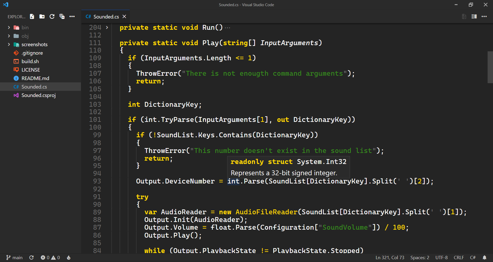
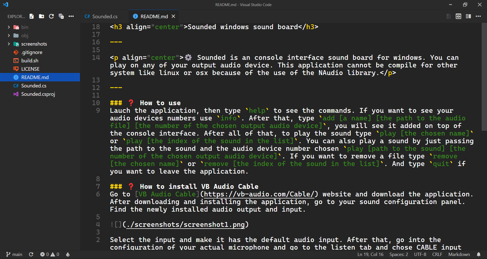
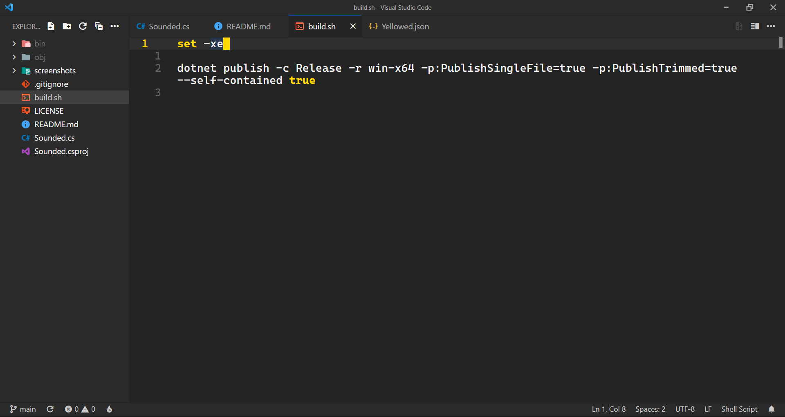

<h3 align="center">Visual Studio Code configuration</h3>

---

⚙️ This is my configuration for Visual Studio Code. The key bindings can be difficult to understand. You can see with the keybindings.json and the awesome emacs keymap extension.

⚠️ I only added the extensions that change vs code, not the ones related to the languages.

---

### 🖼️ Screenshots

### 📃 Font
- [Cascadia Code](https://github.com/microsoft/cascadia-code)

### 🏞️ Theme
- [Yellowed](https://marketplace.visualstudio.com/items?itemName=gael-lopes-da-silva.yellowed)

### ⚙️ Extensions
- [Awesome Emacs Keymap](https://marketplace.visualstudio.com/items?itemName=tuttieee.emacs-mcx)
- [Better Align](https://marketplace.visualstudio.com/items?itemName=wwm.better-align)
- [Command Runner](https://marketplace.visualstudio.com/items?itemName=edonet.vscode-command-runner)
- [Conventional Commits](https://marketplace.visualstudio.com/items?itemName=vivaxy.vscode-conventional-commits)
- [Error Lens](https://marketplace.visualstudio.com/items?itemName=usernamehw.errorlens)
- [Hex Editor](https://marketplace.visualstudio.com/items?itemName=ms-vscode.hexeditor)
- [IntelliCode](https://marketplace.visualstudio.com/items?itemName=VisualStudioExptTeam.vscodeintellicode)
- [Licence Snippets](https://marketplace.visualstudio.com/items?itemName=benemohamed.licence-snippets)
- [Live Preview](https://marketplace.visualstudio.com/items?itemName=ms-vscode.live-server)
- [Material Icon Theme](https://marketplace.visualstudio.com/items?itemName=PKief.material-icon-theme)
- [Material Product Icons](https://marketplace.visualstudio.com/items?itemName=PKief.material-product-icons)
- [Output Colorizer](https://marketplace.visualstudio.com/items?itemName=IBM.output-colorizer)
- [Path Intellisense](https://marketplace.visualstudio.com/items?itemName=christian-kohler.path-intellisense)
- [TODO Highlight](https://marketplace.visualstudio.com/items?itemName=wayou.vscode-todo-highlight)

### 🔧 Settings
~~~json with comments
{
    // options
    "debug.openDebug": "neverOpen",
    "debug.terminal.clearBeforeReusing": true,
    "diffEditor.codeLens": true,
    "diffEditor.wordWrap": "inherit",
    "editor.autoIndent": "full",
    "editor.autoClosingBrackets": "always",
    "editor.autoClosingQuotes": "always",
    "editor.bracketPairColorization.enabled": false,
    "editor.codeLens": true,
    "editor.colorDecorators": true,
    "editor.cursorWidth": 3,
    "editor.codeLensFontFamily": "Cascadia Code, monospace",
    "editor.cursorStyle": "block",
    "editor.cursorBlinking": "solid",
    "editor.detectIndentation": false,
    "editor.dragAndDrop": false,
    "editor.emptySelectionClipboard": true,
    "editor.folding": true,
    "editor.foldingHighlight": false,
    "editor.foldingStrategy": "auto",
    "editor.fastScrollSensitivity": 5,
    "editor.fontSize": 18,
    "editor.fontFamily": "Cascadia Code, monospace",
    "editor.guides.indentation": true,
    "editor.guides.bracketPairs": false,
    "editor.hideCursorInOverviewRuler": true,
    "editor.insertSpaces": true,
    "editor.linkedEditing": false,
    "editor.largeFileOptimizations": true,
    "editor.lightbulb.enabled": false,
    "editor.links": true,
    "editor.letterSpacing": 0.2,
    "editor.lineHeight": 21,
    "editor.lineNumbers": "relative",
    "editor.matchBrackets": "always",
    "editor.minimap.enabled": false,
    "editor.overviewRulerBorder": false,
    "editor.padding.bottom": 1,
    "editor.padding.top": 1,
    "editor.quickSuggestionsDelay": 0,
    "editor.renderWhitespace": "selection",
    "editor.renderLineHighlight": "all",
    "editor.suggestFontSize": 17,
    "editor.suggestLineHeight": 22,
    "editor.suggestSelection": "first",
    "editor.suggest.preview": true,
    "editor.tabSize": 4,
    "editor.unicodeHighlight.invisibleCharacters": false,
    "editor.wordWrap": "bounded",
    "editor.wordWrapColumn": 150,
    "editor.wrappingIndent": "same",
    "editor.wrappingStrategy": "simple",
    "explorer.compactFolders": false,
    "explorer.confirmDelete": false,
    "extensions.ignoreRecommendations": true,
    "files.autoSave": "afterDelay",
    "files.defaultLanguage": "${activeEditorLanguage}",
    "files.enableTrash": true,
    "files.encoding": "utf8",
    "files.eol": "\n",
    "files.insertFinalNewline": true,
    "files.restoreUndoStack": true,
    "git.autofetch": true,
    "git.confirmSync": false,
    "git.enableSmartCommit": true,
    "security.workspace.trust.enabled": false,
    "terminal.integrated.customGlyphs": true,
    "terminal.integrated.enableFileLinks": true,
    "terminal.integrated.fontFamily": "CaskaydiaCove Nerd Font Mono, monospace",
    "terminal.integrated.gpuAcceleration": "on",
    "terminal.integrated.defaultProfile.windows": "PowerShell",
    "terminal.integrated.profiles.windows": {
        "PowerShell": {
            "source": "PowerShell",
            "icon": "terminal-powershell",
            "args": [
                "-nologo"
            ]
        }
    },
    "terminal.integrated.shellIntegration.enabled": true,
    "terminal.integrated.shellIntegration.decorationIcon": "circle-outline",
    "terminal.integrated.shellIntegration.decorationIconError": "error-small",
    "terminal.integrated.shellIntegration.decorationIconSuccess": "primitive-dot",
    "terminal.integrated.shellIntegration.decorationsEnabled": true,
    "terminal.integrated.shellIntegration.showWelcome": false,
    "terminal.integrated.showLinkHover": true,
    "window.dialogStyle": "custom",
    "window.menuBarVisibility": "hidden",
    "window.titleBarStyle": "custom",
    "window.title": "${rootName}${separator}${dirty}${activeEditorShort}${separator}${appName}",
    "window.zoomLevel": 1,
    "workbench.activityBar.visible": false,
    "workbench.editor.enablePreview": false,
    "workbench.iconTheme": "material-icon-theme",
    "workbench.productIconTheme": "material-product-icons",
    "workbench.colorTheme": "Yellowed",

    // extensions
    "csharp.referencesCodeLens.enabled": false,
    "csharp.suppressBuildAssetsNotification": true,
    "gopls": {"build.experimentalWorkspaceModule": true},
    "go.toolsManagement.autoUpdate": true,
    "conventionalCommits.showNewVersionNotes": false,
    "conventionalCommits.lineBreak": "\\n",
    "command-runner.terminal.autoFocus": true,
    "command-runner.terminal.autoClear": false,
    "command-runner.terminal.cwd": "${fileDirname}",
    "command-runner.terminal.name": "script",
    "command-runner.terminal.shellArgs": "-nologo",
    "command-runner.commands": {
        // not simple
        "C"   : "clang -Wall -Wextra -pedantic -fno-common -fno-builtin ${file} -o ${fileBasenameNoExtension} ; if ($?) {./${fileBasenameNoExtension}}",
        "C++" : "clang++ -Wall -Wextra -pedantic -fno-common -fno-builtin ${file} -o ${fileBasenameNoExtension} ; if ($?) {./${fileBasenameNoExtension}}",
        "Java": "javac ${file} ; if ($?) {java ${fileBasenameNoExtension}}",

        // simple
        "Nim"      : "nim c -r --hints:off --spellSuggest:0 ${file}",
        "Nims"     : "nim -r --hints:off --spellSuggest:0 ${file}",
        "C#"       : "dotnet run",
        "C# Script": "dotnet script ${file}",
        "Go"       : "go run .",
        "Python"   : "pypy ${file}",
        "Shell"    : "sh ${file}"
    },
    "hexeditor.columnWidth": 16,
    "hexeditor.showDecodedText": true,
    "hexeditor.defaultEndianness": "little",
    "hexeditor.inspectorType": "aside",
    "errorLens.followCursor": "allLines",
    "errorLens.fontFamily": "Cascadia Code, monospace",
    "errorLens.gutterIconsEnabled": true,
    "errorLens.messageBackgroundMode": "none",
    "errorLens.messageTemplate": "$severity: $message",
    "errorLens.removeLinebreaks": false,
    "errorLens.scrollbarHackEnabled": true,
    "todohighlight.isEnable": true,
    "todohighlight.isCaseSensitive": false,
    "todohighlight.maxFilesForSearch": 5120,
    "todohighlight.include": ["**/*.*"],
    "todohighlight.keywords": [
        {
            "text"           : "TODO:",
            "color"          : "#ecf0f1",
            "border"         : "1px solid #e74c3c",
            "borderRadius"   : "4px",
            "backgroundColor": "#e74c3c"
        },
        {
            "text"           : "FIXME:",
            "color"          : "#ecf0f1",
            "border"         : "1px solid #f1c40f",
            "borderRadius"   : "4px",
            "backgroundColor": "#f1c40f"
        },
        {
            "text"           : "NOTE:",
            "color"          : "#ecf0f1",
            "border"         : "1px solid #3498db",
            "borderRadius"   : "4px",
            "backgroundColor": "#3498db"
        },
        {
            "text"           : "HACK:",
            "color"          : "#ecf0f1",
            "border"         : "1px solid #9b59b6",
            "borderRadius"   : "4px",
            "backgroundColor": "#9b59b6"
        },
        {
            "text"           : "BUG:",
            "color"          : "#ecf0f1",
            "border"         : "1px solid #2ecc71",
            "borderRadius"   : "4px",
            "backgroundColor": "#2ecc71"
        },
        {
            "text"           : "XXX:",
            "color"          : "#ecf0f1",
            "border"         : "1px solid #3c3d4d",
            "borderRadius"   : "4px",
            "backgroundColor": "#3c3d4d"
        }
    ]
}
~~~

### ⌨️ Keybindings
~~~json with comments
[
  // vscode
  {
    "key": "alt+oem_plus",
    "command": "editor.action.fontZoomIn"
  },
  {
    "key": "alt+oem_minus",
    "command": "editor.action.fontZoomOut"
  },
  {
    "key": "shift+alt+backspace",
    "command": "editor.action.fontZoomReset"
  },
  {
    "key": "ctrl+shift+l",
    "command": "workbench.action.editor.changeLanguageMode",
    "when": "!notebookEditorFocused"
  },
  
  // todo highlight
  {
    "key": "ctrl+x t",
    "command": "emacs-mcx.executeCommandWithPrefixArgument",
    "args": {
      "command": "todohighlight.listAnnotations"
    }
  },

  // command runner
  {
    "key": "ctrl+x c",
    "command": "emacs-mcx.executeCommandWithPrefixArgument",
    "args": {
      "command": "command-runner.run"
    }
  },

  // error lens
  {
    "key": "ctrl+x e",
    "command": "emacs-mcx.executeCommandWithPrefixArgument",
    "args": {
      "command": "errorLens.toggle"
    }
  },

  // emacs
  {
    "key": "shift+space",
    "command": "editor.action.triggerSuggest",
    "when": "editorHasCompletionItemProvider && textInputFocus && !editorReadonly"
  },
  {
    "key": "ctrl+x ctrl+j",
    "command": "emacs-mcx.executeCommandWithPrefixArgument",
    "args": {
      "command": "workbench.action.terminal.killAll"
    }
  }
]
~~~
