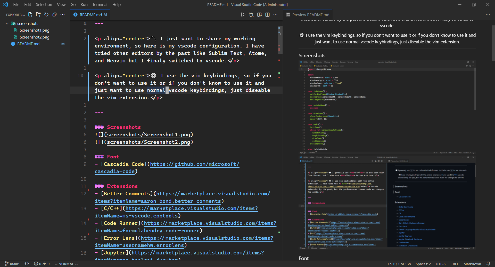
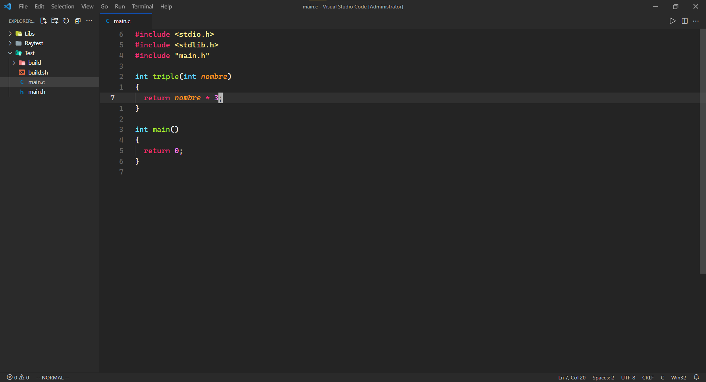

<h3 align="center">Visual studio code configuration</h3>

---

⚙️ I use emacs keybindings, so if you don't want to use it or if you don't know how to use it you can diseable the emacs extension.

---

### 🖼️ Screenshots

### 📃 Font
- [Cascadia Code](https://github.com/microsoft/cascadia-code)

### ⚙️ Extensions
- [Awesome Emacs Keymap](https://marketplace.visualstudio.com/items?itemName=tuttieee.emacs-mcx)
- [C/C++](https://marketplace.visualstudio.com/items?itemName=ms-vscode.cpptools)
- [C#](https://marketplace.visualstudio.com/items?itemName=ms-dotnettools.csharp)
- [Command Runner](https://marketplace.visualstudio.com/items?itemName=edonet.vscode-command-runner)
- [Error Lens](https://marketplace.visualstudio.com/items?itemName=usernamehw.errorlens)
- [Live Preview](https://marketplace.visualstudio.com/items?itemName=ms-vscode.live-server)
- [Material Icon Theme](https://marketplace.visualstudio.com/items?itemName=PKief.material-icon-theme)
- [Material Product Icons](https://marketplace.visualstudio.com/items?itemName=PKief.material-product-icons)
- [Output Colorizer](https://marketplace.visualstudio.com/items?itemName=IBM.output-colorizer)
- [Path Intellisense](https://marketplace.visualstudio.com/items?itemName=christian-kohler.path-intellisense)
- [Pylance](https://marketplace.visualstudio.com/items?itemName=ms-python.vscode-pylance)
- [Python](https://marketplace.visualstudio.com/items?itemName=ms-python.python)
- [TODO Highlight](https://marketplace.visualstudio.com/items?itemName=wayou.vscode-todo-highlight)
- [Visual Studio IntelliCode](https://marketplace.visualstudio.com/items?itemName=VisualStudioExptTeam.vscodeintellicode)

- [Yellowed](https://github.com/Gael-Lopes-Da-Silva/Yellowed)

### 🔧 Settings
~~~json with comments
{
  // options
  "breadcrumbs.enabled": false,
  "debug.openDebug": "neverOpen",
  "debug.terminal.clearBeforeReusing": true,
  "diffEditor.codeLens": true,
  "diffEditor.wordWrap": "inherit",
  "editor.autoIndent": "full",
  "editor.autoClosingBrackets": "always",
  "editor.autoClosingQuotes": "always",
  "editor.codeLens": true,
  "editor.colorDecorators": true,
  "editor.cursorWidth": 3,
  "editor.codeLensFontFamily": "Cascadia Code, monospace",
  "editor.cursorStyle": "block",
  "editor.cursorBlinking": "solid",
  "editor.detectIndentation": false,
  "editor.definitionLinkOpensInPeek": true,
  "editor.dragAndDrop": false,
  "editor.emptySelectionClipboard": true,
  "editor.folding": true,
  "editor.foldingHighlight": false,
  "editor.foldingStrategy": "auto",
  "editor.fastScrollSensitivity": 5,
  "editor.fontSize": 18,
  "editor.fontFamily": "Cascadia Code, monospace",
  "editor.guides.indentation": true,
  "editor.guides.bracketPairs": false,
  "editor.hideCursorInOverviewRuler": true,
  "editor.insertSpaces": true,
  "editor.linkedEditing": false,
  "editor.largeFileOptimizations": true,
  "editor.lightbulb.enabled": false,
  "editor.links": true,
  "editor.letterSpacing": 0.2,
  "editor.lineHeight": 20,
  "editor.lineNumbers": "relative",
  "editor.mouseWheelZoom": true,
  "editor.matchBrackets": "always",
  "editor.minimap.enabled": false,
  "editor.overviewRulerBorder": false,
  "editor.padding.bottom": 1,
  "editor.padding.top": 1,
  "editor.quickSuggestionsDelay": 0,
  "editor.renderWhitespace": "selection",
  "editor.renderLineHighlight": "all",
  "editor.suggestSelection": "first",
  "editor.suggest.preview": true,
  "editor.tabSize": 2,
  "editor.unicodeHighlight.invisibleCharacters": false,
  "editor.wordWrap": "bounded",
  "editor.wordWrapColumn": 150,
  "editor.wrappingIndent": "same",
  "editor.wrappingStrategy": "simple",
  "explorer.compactFolders": false,
  "explorer.confirmDelete": false,
  "extensions.ignoreRecommendations": true,
  "files.autoSave": "afterDelay",
  "files.defaultLanguage": "${activeEditorLanguage}",
  "files.enableTrash": true,
  "files.encoding": "utf8",
  "files.insertFinalNewline": true,
  "files.restoreUndoStack": true,
  "git.autofetch": true,
  "git.confirmSync": false,
  "git.enableSmartCommit": true,
  "security.workspace.trust.enabled": false,
  "terminal.integrated.customGlyphs": true,
  "terminal.integrated.fontFamily": "Cascadia Code, monospace",
  "terminal.integrated.gpuAcceleration": "on",
  "window.dialogStyle": "custom",
  "window.menuBarVisibility": "hidden",
  "window.titleBarStyle": "custom",
  "window.title": "${rootName}${separator}$${dirty}${activeEditorShort}${separator}${appName}",
  "window.zoomLevel": 1,
  "workbench.activityBar.visible": false,
  "workbench.colorTheme": "Yellowed",
  "workbench.editor.enablePreview": false,
  "workbench.iconTheme": "material-icon-theme",
  "workbench.productIconTheme": "material-product-icons",

  // extensions
  "csharp.referencesCodeLens.enabled": false,
  "command-runner.terminal.autoFocus": true,
  "command-runner.terminal.cwd": "${fileDirname}",
  "command-runner.terminal.name": "script",
  "command-runner.commands": {
    "C": "clear \nclang ${fileBasename} -o ${fileBasenameNoExtension} ; ./${fileBasenameNoExtension}.exe",
    "C#": "clear \ndotnet run",
    "C++": "clear \nclang++ ${fileBasename} -o ${fileBasenameNoExtension} ; ./${fileBasenameNoExtension}.exe",
    "Python": "clear \npypy ${fileBasename}",
    "Java": "clear \njavac ${fileBasename} ; java ${fileBasenameNoExtension}",
    "Shell": "clear \nbash ${fileBasename}"
  },
  "errorLens.delay": 1,
  "errorLens.followCursor": "allLines",
  "errorLens.fontFamily": "Cascadia Code, monospace",
  "errorLens.gutterIconsEnabled": true,
  "errorLens.removeLinebreaks": false,
  "todohighlight.isEnable": true,
  "todohighlight.isCaseSensitive": false,
  "todohighlight.maxFilesForSearch": 5120,
  "todohighlight.include": [
    "**/*.*"
  ],
  "todohighlight.keywords": [
    {
      "text": "TODO:",
      "color": "#ecf0f1",
      "border": "1px solid #e74c3c",
      "borderRadius": "4px",
      "backgroundColor": "#e74c3c"
    },
    {
      "text": "FIXME:",
      "color": "#ecf0f1",
      "border": "1px solid #f1c40f",
      "borderRadius": "4px",
      "backgroundColor": "#f1c40f"
    },
    {
      "text": "NOTE:",
      "color": "#ecf0f1",
      "border": "1px solid #3498db",
      "borderRadius": "4px",
      "backgroundColor": "#3498db"
    },
    {
      "text": "HACK:",
      "color": "#ecf0f1",
      "border": "1px solid #9b59b6",
      "borderRadius": "4px",
      "backgroundColor": "#9b59b6"
    },
    {
      "text": "BUG:",
      "color": "#ecf0f1",
      "border": "1px solid #2ecc71",
      "borderRadius": "4px",
      "backgroundColor": "#2ecc71"
    },
    {
      "text": "XXX:",
      "color": "#ecf0f1",
      "border": "1px solid #3c3d4d",
      "borderRadius": "4px",
      "backgroundColor": "#3c3d4d"
    }
  ]
}
~~~

### ⌨️ Keybindings
~~~json with comments
[
  // vscode
  {
    "key": "alt+oem_plus",
    "command": "editor.action.fontZoomIn"
  },
  {
    "key": "alt+oem_minus",
    "command": "editor.action.fontZoomOut"
  },
  {
    "key": "ctrl+alt+backspace",
    "command": "editor.action.fontZoomReset"
  },
  {
    "key": "shift+alt+t",
    "command": "todohighlight.listAnnotations"
  },

  // emacs
  {
    "key": "ctrl+x f",
    "command": "emacs-mcx.executeCommandWithPrefixArgument",
    "args": {
      "command": "workbench.action.files.openFolder",
      "when": "openFolderWorkspaceSupport"
    }
  },
  {
    "key": "ctrl+x /",
    "command": "emacs-mcx.executeCommandWithPrefixArgument",
    "args": {
      "command": "redo"
    }
  }
]
~~~
