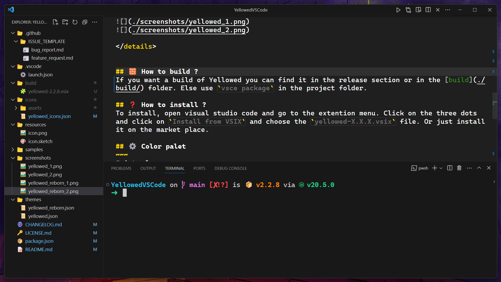

<h1 align="center">
    My Visual Studio Code configuration
</h1>

> [!NOTE]
> This is my configuration for Visual Studio Code. The key bindings can be difficult to understand. You can see with the keybindings.json or the keybinding extentions.

> [!WARNING]
> I only added extensions that change Visual Studio Code or add features, I have not added the ones related to programming languages. Same for the settings.

## 🖼️ Screenshots

## 🏞️ Theme
- [Yellowed Marketplace](https://marketplace.visualstudio.com/items?itemName=gael-lopes-da-silva.yellowed)
- [Yellowed Github](https://github.com/Gael-Lopes-Da-Silva/Yellowed)

## ⚙️ Extensions
- [Better Align](https://marketplace.visualstudio.com/items?itemName=Chouzz.vscode-better-align)
- [Code Runner](https://marketplace.visualstudio.com/items?itemName=formulahendry.code-runner)
- [Command Runner](https://marketplace.visualstudio.com/items?itemName=edonet.vscode-command-runner)
- [Error Lens](https://marketplace.visualstudio.com/items?itemName=usernamehw.errorlens)
- [Hex Editor](https://marketplace.visualstudio.com/items?itemName=ms-vscode.hexeditor)
- [IntelliCode](https://marketplace.visualstudio.com/items?itemName=VisualStudioExptTeam.vscodeintellicode)
- [IntelliCode Completions](https://marketplace.visualstudio.com/items?itemName=VisualStudioExptTeam.vscodeintellicode-completions)
- [Live Preview](https://marketplace.visualstudio.com/items?itemName=ms-vscode.live-server)
- [Markdown All in One](https://marketplace.visualstudio.com/items?itemName=yzhang.markdown-all-in-one)
- [Markdown Emoji](https://marketplace.visualstudio.com/items?itemName=bierner.markdown-emoji)
- [Path Intellisense](https://marketplace.visualstudio.com/items?itemName=christian-kohler.path-intellisense)
- [Path Tools](https://marketplace.visualstudio.com/items?itemName=cg-cnu.vscode-path-tools)
- [Peek Hidden Files](https://marketplace.visualstudio.com/items?itemName=adrianwilczynski.toggle-hidden)
- [Text Utils](https://marketplace.visualstudio.com/items?itemName=itsbp.text-utils)
- [Ultimate Hover](https://marketplace.visualstudio.com/items?itemName=szpro.ultimatehover)

## 🔧 Settings
~~~json
{
	// Theme
	"editor.semanticHighlighting.enabled": false,
	"editor.semanticTokenColorCustomizations": {
		"enabled": false
	},
	// extensions
	"code-runner.clearPreviousOutput": true,
	"command-runner.terminal.autoClear": false,
	"command-runner.terminal.autoFocus": true,
	"command-runner.terminal.cwd": "${fileDirname}",
	"command-runner.terminal.name": "script",
	"errorLens.borderRadius": "3px",
	"errorLens.delay": 100,
	"errorLens.enabled": true,
	"errorLens.enabledInMergeConflict": true,
	"errorLens.enableOnDiffView": true,
	"errorLens.followCursor": "allLines",
	"errorLens.fontSize": "14",
	"errorLens.messageBackgroundMode": "message",
	"errorLens.messageTemplate": "$message",
	"errorLens.onSave": false,
	"errorLens.padding": "0px 10px 0px 10px",
	"errorLens.removeLinebreaks": false,
	"errorLens.scrollbarHackEnabled": true,
	"hexeditor.columnWidth": 16,
	"hexeditor.defaultEndianness": "little",
	"hexeditor.inspectorType": "aside",
	"hexeditor.showDecodedText": true,
	"markdown.extension.list.indentationSize": "inherit",
	"markdown.extension.theming.decoration.renderCodeSpan": true,
	// Settings
	"breadcrumbs.enabled": false,
	"breadcrumbs.filePath": "off",
	"breadcrumbs.icons": true,
	"debug.console.closeOnEnd": false,
	"debug.internalConsoleOptions": "openOnSessionStart",
	"debug.openDebug": "openOnDebugBreak",
	"debug.saveBeforeStart": "allEditorsInActiveGroup",
	"debug.terminal.clearBeforeReusing": true,
	"diffEditor.codeLens": true,
	"diffEditor.wordWrap": "inherit",
	"editor.autoClosingBrackets": "languageDefined",
	"editor.autoClosingQuotes": "languageDefined",
	"editor.autoIndent": "full",
	"editor.bracketPairColorization.enabled": false,
	"editor.codeLens": true,
	"editor.colorDecorators": true,
	"editor.comments.insertSpace": true,
	"editor.cursorBlinking": "solid",
	"editor.cursorStyle": "block",
	"editor.cursorWidth": 3,
	"editor.definitionLinkOpensInPeek": false,
	"editor.detectIndentation": false,
	"editor.dragAndDrop": false,
	"editor.emptySelectionClipboard": true,
	"editor.fastScrollSensitivity": 5,
	"editor.find.autoFindInSelection": "multiline",
	"editor.find.seedSearchStringFromSelection": "selection",
	"editor.folding": false,
	"editor.foldingHighlight": false,
	"editor.foldingStrategy": "auto",
	"editor.fontFamily": "Cascadia Code, Source Code Pro",
	"editor.fontLigatures": false,
	"editor.fontSize": 18,
	"editor.formatOnSave": true,
	"editor.gotoLocation.multipleDefinitions": "goto",
	"editor.guides.bracketPairs": false,
	"editor.guides.indentation": true,
	"editor.hideCursorInOverviewRuler": false,
	"editor.inlayHints.enabled": "on",
	"editor.inlayHints.fontSize": 14,
	"editor.inlayHints.padding": true,
	"editor.inlineSuggest.enabled": true,
	"editor.inlineSuggest.showToolbar": "onHover",
	"editor.insertSpaces": false,
	"editor.largeFileOptimizations": true,
	"editor.letterSpacing": 0.2,
	"editor.lightbulb.enabled": "off",
	"editor.lineHeight": 22,
	"editor.lineNumbers": "off",
	"editor.linkedEditing": false,
	"editor.links": true,
	"editor.matchBrackets": "always",
	"editor.minimap.enabled": false,
	"editor.overviewRulerBorder": false,
	"editor.padding.bottom": 20,
	"editor.padding.top": 20,
	"editor.quickSuggestionsDelay": 0,
	"editor.renderLineHighlight": "line",
	"editor.renderWhitespace": "none",
	"editor.scrollBeyondLastColumn": 4,
	"editor.scrollBeyondLastLine": false,
	"editor.showFoldingControls": "always",
	"editor.smoothScrolling": false,
	"editor.suggest.filterGraceful": true,
	"editor.suggest.insertMode": "replace",
	"editor.suggest.localityBonus": true,
	"editor.suggest.matchOnWordStartOnly": true,
	"editor.suggest.preview": false,
	"editor.suggest.selectionMode": "always",
	"editor.tabSize": 4,
	"editor.unicodeHighlight.ambiguousCharacters": true,
	"editor.unicodeHighlight.includeComments": false,
	"editor.unicodeHighlight.includeStrings": false,
	"editor.unicodeHighlight.invisibleCharacters": true,
	"editor.unicodeHighlight.nonBasicASCII": false,
	"editor.wordWrap": "bounded",
	"editor.wordWrapColumn": 150,
	"editor.wrappingIndent": "same",
	"editor.wrappingStrategy": "simple",
	"explorer.autoReveal": false,
	"explorer.compactFolders": false,
	"explorer.confirmDelete": false,
	"explorer.confirmDragAndDrop": false,
	"explorer.confirmPasteNative": false,
	"explorer.excludeGitIgnore": false,
	"explorer.incrementalNaming": "smart",
	"extensions.ignoreRecommendations": true,
	"files.autoSave": "afterDelay",
	"files.autoSaveDelay": 1000,
	"files.enableTrash": true,
	"files.encoding": "utf8",
	"files.eol": "\n",
	"files.exclude": {
		"**/.git": true,
		"**/.godot": true,
		"**/.vs": true,
		"**/zig-cache": true,
		"**/zig-out": true
	},
	"files.insertFinalNewline": false,
	"files.refactoring.autoSave": true,
	"files.restoreUndoStack": true,
	"files.saveConflictResolution": "overwriteFileOnDisk",
	"files.simpleDialog.enable": true,
	"git.autofetch": "all",
	"git.closeDiffOnOperation": true,
	"git.confirmSync": false,
	"git.enableSmartCommit": true,
	"git.fetchOnPull": true,
	"git.useEditorAsCommitInput": true,
	"notebook.showFoldingControls": "always",
	"security.workspace.trust.enabled": false,
	"telemetry.telemetryLevel": "off",
	"terminal.external.windowsExec": "pwsh",
	"terminal.integrated.customGlyphs": true,
	"terminal.integrated.defaultProfile.windows": "PowerShell",
	"terminal.integrated.enableFileLinks": "on",
	"terminal.integrated.fontFamily": "CaskaydiaCove Nerd Font, Cascadia Code, Source Code Pro",
	"terminal.integrated.fontSize": 18,
	"terminal.integrated.gpuAcceleration": "on",
	"terminal.integrated.shellIntegration.enabled": true,
	"terminal.integrated.showLinkHover": true,
	"window.commandCenter": false,
	"window.confirmBeforeClose": "keyboardOnly",
	"window.dialogStyle": "custom",
	"window.enableMenuBarMnemonics": false,
	"window.menuBarVisibility": "hidden",
	"window.title": "${rootName}",
	"window.titleBarStyle": "custom",
	"window.zoomLevel": 0.8,
	"workbench.activityBar.location": "hidden",
	"workbench.colorTheme": "Yellowed Reborn",
	"workbench.commandPalette.experimental.suggestCommands": true,
	"workbench.editor.defaultBinaryEditor": "hexEditor.hexedit",
	"workbench.editor.enablePreview": false,
	"workbench.editor.showTabs": "none",
	"workbench.editor.tabActionCloseVisibility": false,
	"workbench.editor.tabSizing": "shrink",
	"workbench.iconTheme": "yellowed_icons",
	"workbench.layoutControl.enabled": false,
	"workbench.startupEditor": "none",
	"workbench.statusBar.visible": false
}
~~~

## ⌨️ Keybindings
~~~json
[
	// VSCode
	{
		"key": "shift shift",
		"command": "workbench.action.showCommands"
	},
	{
		"key": "ctrl+0 ctrl+0",
		"command": "editor.action.fontZoomReset"
	},
	{
		"key": "ctrl+=",
		"command": "editor.action.fontZoomIn"
	},
	{
		"key": "ctrl+-",
		"command": "editor.action.fontZoomOut"
	},
	// Keymap
	{
		"key": "alt+j",
		"command": "cursorDown",
		"when": "textInputFocus"
	},
	{
		"key": "alt+k",
		"command": "cursorUp",
		"when": "textInputFocus"
	},
	{
		"key": "alt+h",
		"command": "cursorLeft",
		"when": "textInputFocus"
	},
	{
		"key": "alt+l",
		"command": "cursorRight",
		"when": "textInputFocus"
	},
	{
		"key": "alt+shift+j",
		"command": "cursorDownSelect",
		"when": "textInputFocus"
	},
	{
		"key": "alt+shift+k",
		"command": "cursorUpSelect",
		"when": "textInputFocus"
	},
	{
		"key": "alt+shift+h",
		"command": "cursorLeftSelect",
		"when": "textInputFocus"
	},
	{
		"key": "alt+shift+l",
		"command": "cursorRightSelect",
		"when": "textInputFocus"
	},
	{
		"key": "alt+j",
		"command": "workbench.action.quickOpenSelectNext",
		"when": "inQuickOpen"
	},
	{
		"key": "alt+k",
		"command": "workbench.action.quickOpenSelectPrevious",
		"when": "inQuickOpen"
	},
	{
		"key": "alt+j",
		"command": "selectNextSuggestion",
		"when": "suggestWidgetMultipleSuggestions && suggestWidgetVisible && textInputFocus"
	},
	{
		"key": "alt+k",
		"command": "selectPrevSuggestion",
		"when": "suggestWidgetMultipleSuggestions && suggestWidgetVisible && textInputFocus"
	},
	{
		"key": "alt+b",
		"command": "cursorWordLeft",
		"when": "textInputFocus"
	},
	{
		"key": "alt+d",
		"command": "deleteRight",
		"when": "textInputFocus"
	},
	{
		"key": "alt+shift+d",
		"command": "deleteInsideWord",
		"when": "textInputFocus"
	},
	{
		"key": "alt+w",
		"command": "cursorWordRight",
		"when": "textInputFocus"
	},
	{
		"key": "alt+shift+b",
		"command": "cursorWordLeftSelect",
		"when": "textInputFocus"
	},
	{
		"key": "alt+shift+w",
		"command": "cursorWordRightSelect",
		"when": "textInputFocus"
	},
	{
		"key": "alt+q",
		"command": "workbench.action.toggleSidebarVisibility"
	},
	{
		"key": "alt+s",
		"command": "editor.action.addSelectionToNextFindMatch",
		"when": "textInputFocus"
	},
	{
		"key": "alt+f",
		"command": "editor.action.showDefinitionPreviewHover",
		"when": "textInputFocus"
	},
	{
		"key": "alt+shift+f",
		"command": "editor.action.triggerParameterHints",
		"when": "editorHasSignatureHelpProvider && editorTextFocus"
	},
	{
		"key": "alt+x",
		"command": "expandLineSelection",
		"when": "textInputFocus"
	},
	{
		"key": "alt+n",
		"command": "workbench.action.terminal.toggleTerminal",
		"when": "terminal.active"
	},
	{
		"key": "alt+p",
		"command": "editor.action.clipboardPasteAction"
	},
	{
		"key": "alt+y",
		"command": "editor.action.clipboardCopyAction"
	},
	{
		"key": "alt+i",
		"command": "workbench.action.quickOpen"
	},
	{
		"key": "alt+/",
		"command": "editor.action.commentLine",
		"when": "editorTextFocus && !editorReadonly"
	},
	{
		"key": "alt+'",
		"command": "editor.action.triggerSuggest",
		"when": "editorHasCompletionItemProvider && textInputFocus && !editorReadonly"
	},
	{
		"key": "alt+'",
		"command": "toggleSuggestionDetails",
		"when": "suggestWidgetVisible && textInputFocus"
	},
	{
		"key": "alt+u",
		"command": "undo"
	},
	{
		"key": "alt+shift+u",
		"command": "redo"
	},
	{
		"key": "ctrl+j ctrl+e",
		"command": "workbench.view.explorer",
		"when": "viewContainer.workbench.view.explorer.enabled"
	},
	{
		"key": "ctrl+j ctrl+g",
		"command": "workbench.view.scm",
		"when": "workbench.scm.active"
	},
	{
		"key": "ctrl+j ctrl+b",
		"command": "workbench.action.toggleActivityBarVisibility"
	},
	{
		"key": "ctrl+j ctrl+z",
		"command": "workbench.action.toggleZenMode"
	},
	{
		"key": "alt+g alt+l",
		"command": "cursorEnd",
		"when": "textInputFocus"
	},
	{
		"key": "alt+g alt+h",
		"command": "cursorHome",
		"when": "textInputFocus"
	},
	{
		"key": "alt+g alt+k",
		"command": "cursorTop",
		"when": "textInputFocus"
	},
	{
		"key": "alt+g alt+j",
		"command": "cursorBottom",
		"when": "textInputFocus"
	},
	{
		"key": "alt+g alt+g",
		"command": "workbench.action.gotoLine"
	},
	{
		"key": "alt+\\",
		"command": "editor.action.jumpToBracket",
		"when": "editorTextFocus"
	},
	{
		"key": "alt+enter",
		"command": "editor.action.insertLineAfter",
		"when": "editorTextFocus && !editorReadonly"
	},
	{
		"key": "alt+shift+enter",
		"command": "editor.action.insertLineBefore",
		"when": "editorTextFocus && !editorReadonly"
	},
	{
		"key": "alt+backspace",
		"command": "editor.action.deleteLines",
		"when": "editorTextFocus"
	},
	{
		"key": "alt+c",
		"command": "editor.action.insertCursorBelow",
		"when": "editorTextFocus"
	},
	{
		"key": "alt+shift+c",
		"command": "editor.action.insertCursorAbove",
		"when": "editorTextFocus"
	},
	{
		"key": "alt+o",
		"command": "editor.action.insertLineAfter",
		"when": "editorTextFocus && !editorReadonly"
	},
	{
		"key": "alt+shift+o",
		"command": "editor.action.insertLineBefore",
		"when": "editorTextFocus && !editorReadonly"
	},
]
~~~
